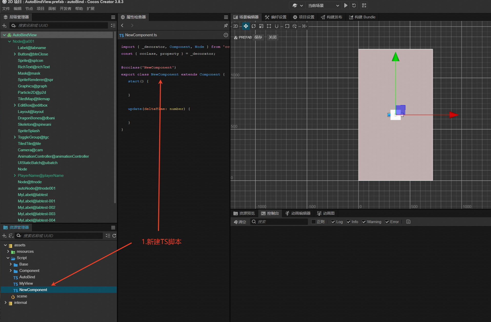
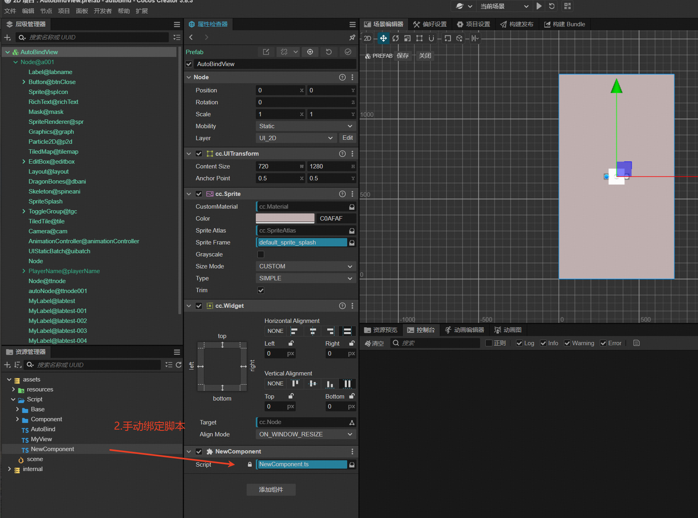
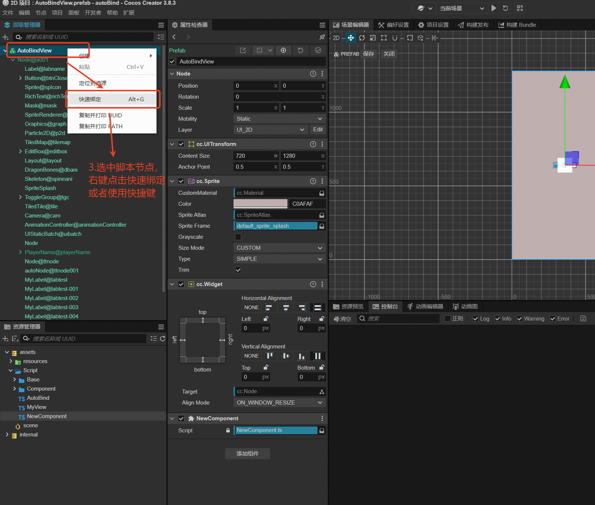
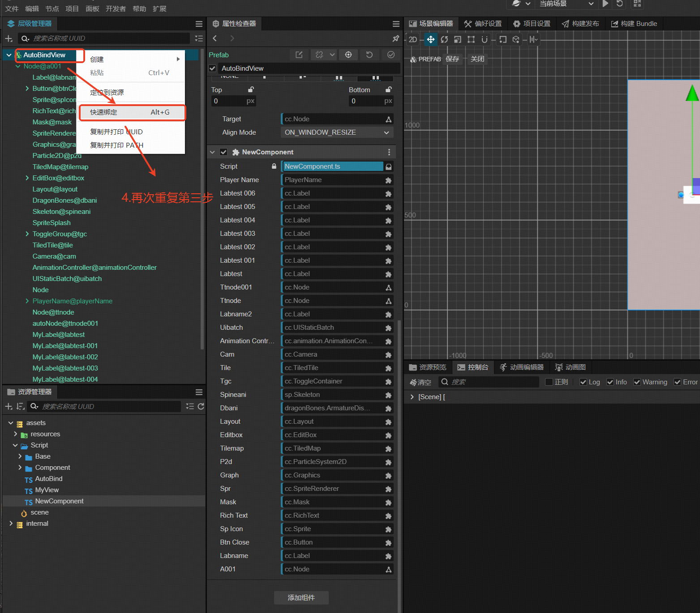
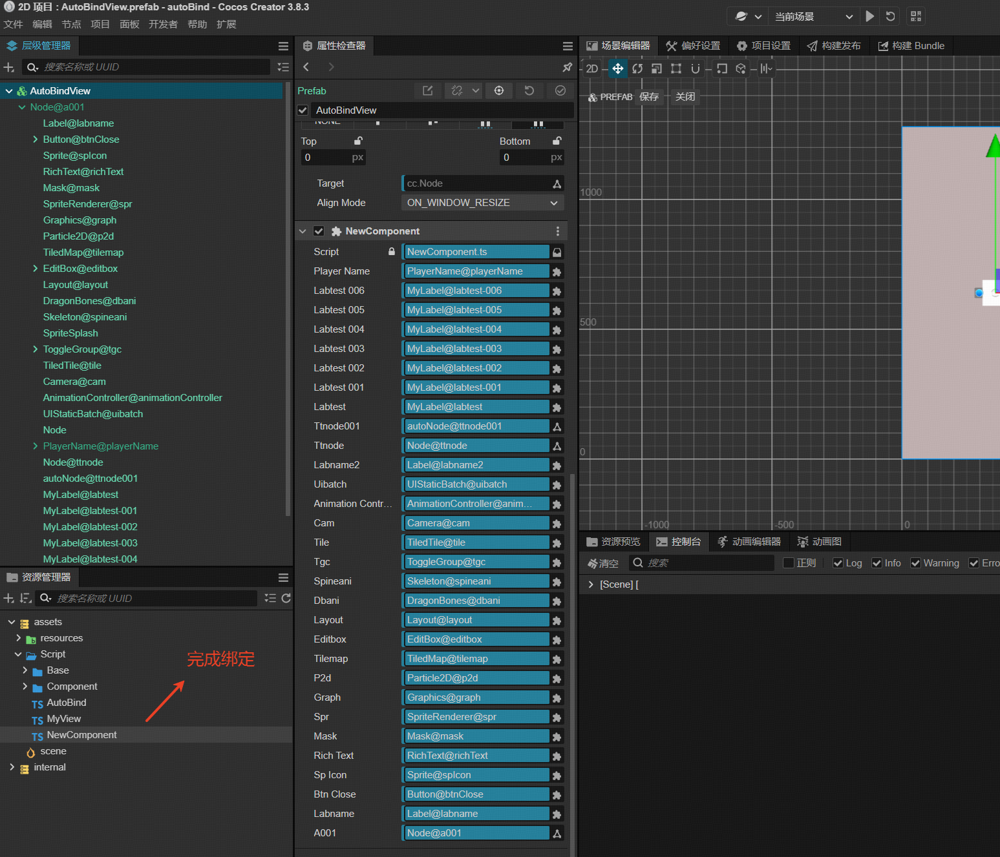

# Best AutoBinder —— Cocos Creator 3.x 自动绑定插件

告别繁琐的手动拖拽绑定 UI，只要节点命名符合规范，一键即可完成 `@property` 声明与脚本的自动绑定。

## 核心优势

- **极简使用**：操作简单直观，上手即用
- **高效绑定**：一键自动生成属性声明并绑定节点
- **无侵入式**：基于 AST 分析，不破坏原有代码结构
- **组件全覆盖**：支持Cocos Creator常用内置组件 + 项目自定义组件

---

## 使用须知

1. **版本限制**：仅支持 Cocos Creator 3.x(只在3.8.3版本测试过，理论上兼容3.x所有版本)
2. **语言限制**：仅支持 TypeScript 脚本
3. **自定义组件**：需保证脚本名称与组件名称完全一致
4. **数据类型**：不支持数组类型（如 `@property([Node])`）
5. **节点重命名**：已经被导出声明的节点，重命名后导出会声明新的变量，旧变量依然保留并且绑定依然有效

## 快速开始

1. 在 Cocos Creator 扩展菜单中启用插件
2. 场景节点按规则命名：`[组件类型]@[属性名]`
3. 选中节点，按 `Alt+G` 或右键选择"绑定"
- 
- 
- 
- 
- 


## 节点命名规范

### 格式

`[组件类型]@[属性名]`，例如：

```
Label@score      → @property(Label) score!: Label
Button@confirm  → @property(Button) confirm!: Button
Sprite@icon    → @property(Sprite) icon!: Sprite
```

### 后缀规则

节点名以 `#` 结尾表示**已绑定完成**，不会递归查询子节点：

- `Button@startBtn#` - 已绑定按钮
- `PlayerName@playerName#` - 已绑定预制体

### 属性名转换

属性名中的 `-` 自动转换为 `_`（TS 变量名不允许 `-`）：

- `Label@score-001` → `@property(Label) score_001!: Label`

---

## 支持的组件类型

| 节点前缀 | 组件类型 | 示例 |
|---------|---------|------|
| Node | cc.Node | Node@root |
| Sprite | cc.Sprite | Sprite@icon |
| Label | cc.Label | Label@score |
| Button | cc.Button | Button@confirm |
| Toggle | cc.Toggle | Toggle@option |
| ToggleGroup | cc.ToggleContainer | ToggleGroup@tgc |
| EditBox | cc.EditBox | EditBox@input |
| ScrollView | cc.ScrollView | ScrollView@area |
| ProgressBar | cc.ProgressBar | ProgressBar@hp |
| Slider | cc.Slider | Slider@vol |
| Layout | cc.Layout | Layout@box |
| RichText | cc.RichText | RichText@msg |
| PageView | cc.PageView | PageView@pages |
| Mask | cc.Mask | Mask@area |
| Graphics | cc.Graphics | Graphics@draw |
| Skeleton | cc.sp.Skeleton | Skeleton@spine |
| DragonBones | cc.dragonBones.ArmatureDisplay | DragonBones@db |
| Animation | cc.Animation | Animation@anim |
| Camera | cc.Camera | Camera@main |
| Widget | cc.Widget | Widget@root |
| MeshRenderer | cc.MeshRenderer | MeshRenderer@model |

---

## 自定义别名

### 设置面板

通过扩展菜单打开设置面板，配置自定义别名：

1. **Cocos 组件类型**：内置完整类型（如 `cc.Label`）
2. **内置别名**：短别名（如 `Label`）
3. **自定义别名**：用户自定义别名

### 使用别名

设置别名后，节点可使用自定义名称：

1. 将 `cc.Label` 设置为 `MyLabel`
2. 场景节点 `MyLabel@playerName`
3. 绑定后生成：
```typescript
import { Label } from 'cc';
@property(Label) playerName!: Label;
```

---

## 自定义组件支持

节点命名为 `[组件名]@[属性名]`，例如：

- `PlayerName@playerName` - 节点上挂载 PlayerName 组件
- 绑定后生成：
```typescript
import { PlayerName } from 'db://assets/Script/Component/PlayerName';
@property(PlayerName) playerName!: PlayerName;
```
## 联系作者
- 微信：shaopianwola（备注autobinder）
- 
## 购买须知
- 本产品为付费虚拟商品，一经购买成功概不退款，请支付前谨慎确认购买内容。
---